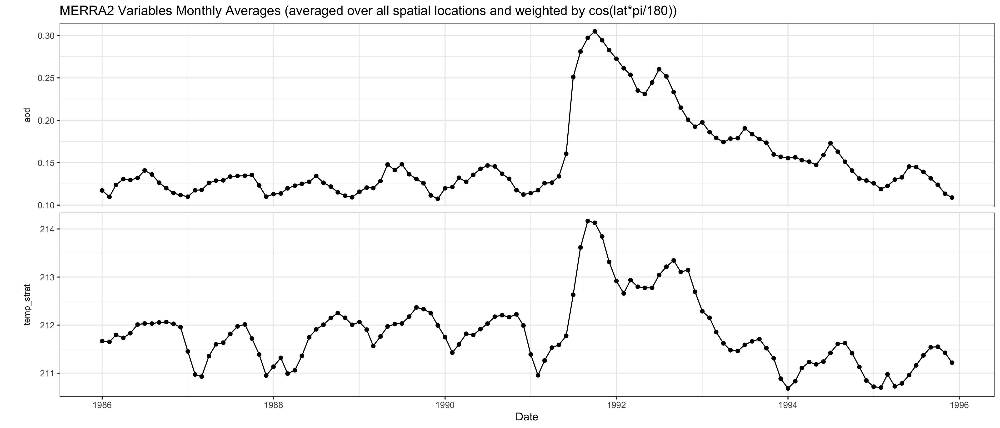
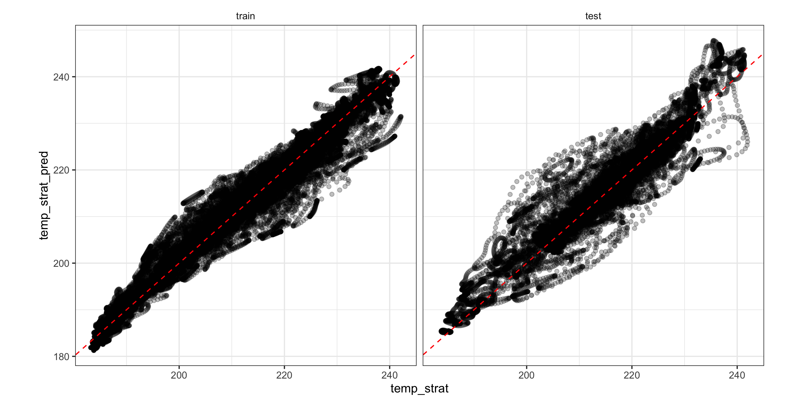
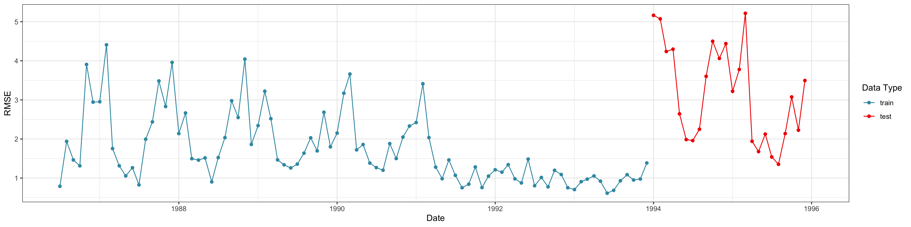
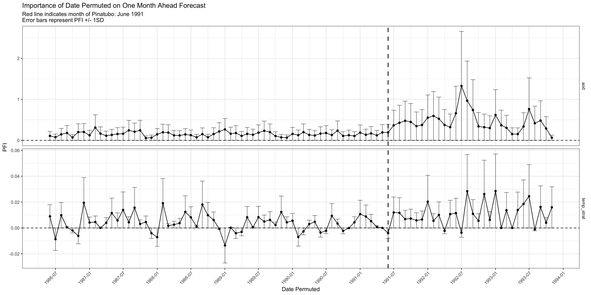
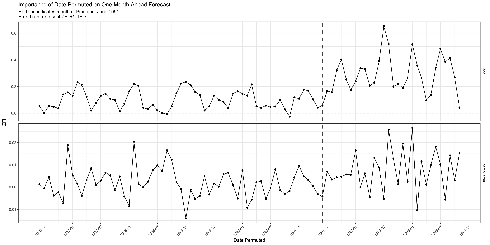

listenr
================

- [Data Steps](#data-steps)
  - [EDA](#eda)
  - [ESN Matrices](#esn-matrices)
  - [EOFs](#eofs)
- [Model](#model)
  - [Training](#training)
- [Forecasts](#forecasts)
  - [Input Data](#input-data)
  - [New Data](#new-data)
  - [Spatial Scale](#spatial-scale)
  - [Join with Data](#join-with-data)
  - [Visualizations](#visualizations)
- [Feature Importance](#feature-importance)
  - [PFI](#pfi)
  - [ZFI](#zfi)

Below is an example using `listenr` to fit an echo-state network (ESN)
model to the MERRA-2 data included in the package (`merra2`). The model
is trained to forecast stratospheric temperatures given lagged
stratospheric temperatures and lagged AOD values. The training data is
monthly data from 1986 to 1993. The testing data is monthly data in 1994
and 1995. PFI and ZFI are applied to identify important times for
forecasting.

Load R packages:

``` r
library(dplyr)
library(ggplot2)
library(listenr)
library(lubridate)
library(stringr)
library(tidyr)
```

## Data Steps

### EDA

Check out `merra2` data included in `listenr`:

``` r
glimpse(merra2)
```

    ## Rows: 138,240
    ## Columns: 12
    ## $ data             <chr> "train", "train", "train", "train", "train", "train",…
    ## $ date             <date> 1986-01-01, 1986-02-01, 1986-03-01, 1986-04-01, 1986…
    ## $ lon              <dbl> -176.5625, -176.5625, -176.5625, -176.5625, -176.5625…
    ## $ lat              <dbl> -86, -86, -86, -86, -86, -86, -86, -86, -86, -86, -86…
    ## $ aod              <dbl> 0.02813766, 0.02528546, 0.02364967, 0.02405622, 0.022…
    ## $ aod_mean         <dbl> 0.08037592, 0.08037592, 0.08037592, 0.08037592, 0.080…
    ## $ aod_sd           <dbl> 0.08037592, 0.08037592, 0.08037592, 0.08037592, 0.080…
    ## $ aod_stdzd        <dbl> -0.6499243, -0.6854100, -0.7057618, -0.7007037, -0.71…
    ## $ temp_strat       <dbl> 235.8260, 230.9777, 222.7908, 210.2770, 198.4632, 189…
    ## $ temp_strat_mean  <dbl> 209.8263, 209.8263, 209.8263, 209.8263, 209.8263, 209…
    ## $ temp_strat_sd    <dbl> 209.8263, 209.8263, 209.8263, 209.8263, 209.8263, 209…
    ## $ temp_strat_stdzd <dbl> 0.123910774, 0.100804656, 0.061787108, 0.002147971, -…

Visualize AOD and stratospheric temperature (global means weighed by
cos(lat)):

<!-- -->

### ESN Matrices

Prepare training data for ESN (only AOD and stratospheric temperature):

``` r
merra2_train = merra2 %>% filter(data == "train")

train_mat_aod <- 
  merra2_train %>%
  select(date, lon, lat, aod_stdzd) %>%
  pivot_wider(
    id_cols = c(lon, lat),
    names_from = date,
    values_from = aod_stdzd
  ) %>%
  select(-lon,-lat) %>%
  t()

train_mat_temp_strat <- 
  merra2_train %>%
  select(date, lon, lat, temp_strat_stdzd) %>%
  pivot_wider(
    id_cols = c(lon, lat),
    names_from = date,
    values_from = temp_strat_stdzd
  ) %>%
  select(-lon,-lat) %>%
  t()
```

Prepare testing data for ESN:

``` r
merra2_test = merra2 %>% filter(data == "test")

test_mat_aod <- 
  merra2_test %>%
  select(date, lon, lat, aod_stdzd) %>%
  pivot_wider(
    id_cols = c(lon, lat),
    names_from = date,
    values_from = aod_stdzd
  ) %>%
  select(-lon,-lat) %>%
  t()

test_mat_temp_strat <- 
  merra2_test %>%
  select(date, lon, lat, temp_strat_stdzd) %>%
  pivot_wider(
    id_cols = c(lon, lat),
    names_from = date,
    values_from = temp_strat_stdzd
  ) %>%
  select(-lon,-lat) %>%
  t()
```

### EOFs

Compute EOFs:

``` r
eofs_aod = compute_eofs(Ztrain = train_mat_aod, Ztest = test_mat_aod, n_eofs = 10)
eofs_temp_strat = compute_eofs(Ztrain = train_mat_temp_strat, Ztest = test_mat_temp_strat, n_eofs = 10)
```

## Model

### Training

Specify model inputs/outputs (AOD and stratospheric temperature are used
to forecast stratospheric temperature):

``` r
x = cbind(eofs_aod$train, eofs_temp_strat$train)
y = eofs_temp_strat$train
```

Extract the times associated with the training data (note that the times
for `x` and `y` are the same):

``` r
t = rownames(x)
```

Train the ESN:

``` r
esn <-
  fit_esn(
    x = x,
    y = y,
    t = as.character(t),
    tau = 1,
    m = 5,
    tau_emb = 1,
    nh = 50,
    add_quad = TRUE, 
    internal_scaling = "joint",
    seed = 20220915
  )
```

## Forecasts

There are two ways to obtain forecasts after training the ESN: forecasts
on the input data or a new set of data.

### Input Data

Forecasts on data input to `fit_esn` are obtained by only inputting the
trained ESN into `predict_esn`. This returns two sets of forecasts:
“in-sample” and “out-of-sample” forecasts. In-sample forecasts are
forecasts made using the “in-sample” `x` values (i.e., the rows in `x`
used to estimate the model parameters). Out-of-sample forecasts are made
using the “out-of-sample” `x` values (i.e., the rows in `x` that are
input to `fit_esn` but excluded from training the model due to the
forecast lag):

``` r
preds_input = predict_esn(model = esn)
```

Both in-sample and out-of-sample forecasts are returned as matrices with
the times of the forecasts attached. However, the in-sample forecasts
list the actual time, while the out-of-sample forecasts list “the time
of the corresponding x value + $\tau$”. The user will need to adjust
these accordingly. In this example, there is only one out-of-sample time
with forecasts since `tau` is 1.

``` r
# In-sample forecast: dimensions
dim(preds_input$preds_ins)
## [1] 90 10

# In-sample forecasts: first 6 rows
head(preds_input$preds_ins)
##                   [,1]        [,2]        [,3]         [,4]         [,5]
## 1986-07-01  1.70192378  0.08309841 -0.11879104  0.002331592 -0.021514503
## 1986-08-01  1.67142488 -0.03978712 -0.08817665 -0.011105295  0.019113662
## 1986-09-01  0.99028291 -0.29592033  0.08764745  0.057181588 -0.005754024
## 1986-10-01  0.09036499 -0.39412725  0.16167834  0.012909954  0.025971256
## 1986-11-01 -0.92864648 -0.19987283  0.10474556  0.060566972  0.001968872
## 1986-12-01 -1.61197047 -0.04014696 -0.01765721  0.026728132  0.075316634
##                    [,6]         [,7]        [,8]         [,9]        [,10]
## 1986-07-01 -0.011456251  0.032395609  0.01246215  0.006445114  0.020760236
## 1986-08-01 -0.019153093  0.034439063 -0.05846413 -0.018262123  0.028362189
## 1986-09-01 -0.065098290  0.005693414 -0.05308112 -0.040597638  0.031237878
## 1986-10-01 -0.082423536  0.044683273 -0.06895532 -0.047962572  0.008892513
## 1986-11-01 -0.038565068  0.007849281  0.02306469 -0.034176854 -0.029258051
## 1986-12-01 -0.004123497 -0.044733236  0.02111695 -0.018844714 -0.030163920

# Out-of-sample forecasts
preds_input$preds_oos
##                     [,1]        [,2]       [,3]       [,4]       [,5]
## 1993-12-01 + 1 -2.363845 -0.01697028 -0.1304319 -0.1955026 0.06094186
##                      [,6]       [,7]       [,8]      [,9]      [,10]
## 1993-12-01 + 1 0.08741614 0.09875742 0.05975413 0.1156359 -0.1246909
```

### New Data

Forecasts on a new set of data can be made by providing an `x_new`
object to `predict_esn`. `x_new` must be a matrix with the same
variables (and number of columns) as `x`. The rows of `x_new` must start
the the time following the last time in `x`. In this scenario, `x` ended
at the date of 1993-12-01. Thus, `x_new` must start at the date of
1994-01-01.

``` r
preds_new <-
  predict_esn(
    model = esn,
    x_new = cbind(eofs_aod$test, eofs_temp_strat$test),
    t_new = as.character(rownames(eofs_aod$test))
  )
```

Both in-sample and out-of-sample forecasts are returned as matrices with
the times of the forecasts attached. However, the in-sample forecasts
list the actual time, while the out-of-sample forecasts list “the time
of the corresponding x value + $\tau$”. The user will need to adjust
these accordingly. In this example, there is only one out-of-sample time
with forecasts since `tau` is 1.

``` r
# Dimensions
dim(preds_new$preds_new)
## [1] 24 10

# First 6 rows
head(preds_new$preds_new)
##                      [,1]       [,2]        [,3]         [,4]        [,5]
## 1994-01-01 + 1 -1.5467139 0.32146732 -0.13361542 -0.288493453  0.02102312
## 1994-02-01 + 1 -0.7242243 0.35505005 -0.31507388 -0.062719085 -0.05114255
## 1994-03-01 + 1 -0.1145228 0.31808021 -0.19953822  0.004300488 -0.07399188
## 1994-04-01 + 1  1.0759729 0.22803355 -0.01065687 -0.040394301 -0.08005195
## 1994-05-01 + 1  1.3479969 0.21699093 -0.10772597 -0.062385615 -0.09522886
## 1994-06-01 + 1  1.4583405 0.09775807 -0.26107090 -0.009916663 -0.08958354
##                       [,6]          [,7]         [,8]        [,9]        [,10]
## 1994-01-01 + 1  0.08416477  0.1055083270  0.081172301  0.12905659 -0.059763915
## 1994-02-01 + 1  0.12164428  0.1274375591  0.017071544  0.14606511 -0.091995466
## 1994-03-01 + 1  0.02962457  0.0637157201 -0.059735907  0.11170913 -0.093762911
## 1994-04-01 + 1 -0.11933843  0.0004933777 -0.033535934  0.07309313 -0.004570167
## 1994-05-01 + 1 -0.04950405 -0.0064514191 -0.038655237  0.01177625 -0.049004644
## 1994-06-01 + 1 -0.02325950  0.0290179118  0.004674542 -0.01730809 -0.008206841
```

### Spatial Scale

Since the ESN was trained using principal components computed from the
spatio-temporal data, the forecasts are returned as principal
components. Here, the forecasts are converted back to the spatial scale:

``` r
spatial_preds = predict_esn(model = esn, phi = eofs_temp_strat$phi)
spatial_preds_new <- 
  predict_esn(
    model = esn, 
    x_new = cbind(eofs_aod$test, eofs_temp_strat$test),
    t_new = as.character(rownames(eofs_aod$test)), 
    phi = eofs_temp_strat$phi
  )
```

### Join with Data

Create a location ID associated with longitude and latitude:

``` r
locations <- 
  merra2_train %>%
  select(date, lon, lat, temp_strat_stdzd) %>%
  pivot_wider(
    id_cols = c(lon, lat),
    names_from = date,
    values_from = temp_strat_stdzd
  ) %>%
  mutate(loc_id = 1:n()) %>%
  select(loc_id, lon, lat)
```

Convert forecasts to a data frames and attach longitude and latitudes:

``` r
spatial_preds_ins_df <- 
  data.frame(spatial_preds$preds_ins) %>%
  tibble::rownames_to_column(var = "date") %>%
  pivot_longer(cols = -date, names_to = "loc_id", values_to = "temp_strat_stdzd_pred") %>%
  mutate(loc_id = as.numeric(str_remove(loc_id, "X"))) %>%
  left_join(locations, by = "loc_id") %>%
  mutate(pred_type = "ins") %>%
  mutate(date = as_date(date))

spatial_preds_oos_df <-
  data.frame(spatial_preds$preds_oos) %>%
  tibble::rownames_to_column(var = "date") %>%
  pivot_longer(cols = -date, names_to = "loc_id", values_to = "temp_strat_stdzd_pred") %>%
  mutate(loc_id = as.numeric(str_remove(loc_id, "X"))) %>%
  left_join(locations, by = "loc_id") %>%
  mutate(pred_type = "oos") %>%
  mutate(date = str_remove(date, " \\+ 1")) %>%
  mutate(date = as_date(date)) %>%
  mutate(date = date %m+% period("1 month"))

spatial_preds_new_df <-
  data.frame(spatial_preds_new$preds_new) %>%
  tibble::rownames_to_column(var = "date") %>%
  pivot_longer(cols = -date, names_to = "loc_id", values_to = "temp_strat_stdzd_pred") %>%
  mutate(loc_id = as.numeric(str_remove(loc_id, "X"))) %>%
  left_join(locations, by = "loc_id") %>%
  mutate(pred_type = "new") %>%
  mutate(date = str_remove(date, " \\+ 1")) %>%
  mutate(date = as_date(date)) %>%
  mutate(date = date %m+% period("1 month"))
```

Join all predictions:

``` r
spatial_preds_all <- 
  bind_rows(spatial_preds_ins_df, spatial_preds_oos_df, spatial_preds_new_df) %>%
  mutate(pred_data = ifelse(pred_type == "ins", "train", "test")) %>%
  mutate(
    pred_type = factor(pred_type, levels = c("ins", "oos", "new")),
    pred_data = factor(pred_data, levels = c("train", "test"))
  )
```

Attach observed values to predictions:

``` r
spatial_preds_plus_obs <-
  left_join(spatial_preds_all, merra2) %>%
  select(
    pred_type,
    pred_data,
    date,
    loc_id,
    lon,
    lat,
    temp_strat,
    temp_strat_mean,
    temp_strat_sd,
    temp_strat_stdzd,
    temp_strat_stdzd_pred
  ) %>%
  mutate(temp_strat_pred = (temp_strat_stdzd_pred * temp_strat_sd) + temp_strat_mean)
```

Check the dates in each prediction group:

``` r
spatial_preds_plus_obs %>%
  group_by(pred_data, pred_type) %>%
  summarise(min(date), max(date))
```

    ## # A tibble: 3 × 4
    ## # Groups:   pred_data [2]
    ##   pred_data pred_type `min(date)` `max(date)`
    ##   <fct>     <fct>     <date>      <date>     
    ## 1 train     ins       1986-07-01  1993-12-01 
    ## 2 test      oos       1994-01-01  1994-01-01 
    ## 3 test      new       1994-02-01  1996-01-01

Note that there are forecasts for January 1, 1996, but there is no
observed data in the test data provided:

``` r
spatial_preds_plus_obs %>% 
  filter(is.na(temp_strat)) %>%
  distinct(date)
```

    ## # A tibble: 1 × 1
    ##   date      
    ##   <date>    
    ## 1 1996-01-01

Compute RMSEs at each time over all spatial locations:

``` r
rmses_by_date <- 
  spatial_preds_plus_obs %>%
  mutate(square_diff = (temp_strat - temp_strat_pred)^2) %>%
  group_by(pred_data, pred_type, date) %>%
  summarise(rmse = sqrt(sum(square_diff) / n()), .groups = "drop")
```

### Visualizations

Plot forecasted stratospheric temperature versus observed stratospheric
temperature separated by training (in-sample) and testing (out-of-sample
and new) data (dashed red line is a 1:1 line):

<!-- -->

RMSEs plotted for each date (color indicates training/testing data):

<!-- -->

## Feature Importance

### PFI

Compute PFI separately for AOD and stratospheric temperature:

``` r
pfi <-
  compute_fi(
    model = esn,
    type = "pfi",
    nreps = 10,
    var_groups = list(1:10, 11:20),
    seed = 20220915
  )
```

Clean up PFI results:

``` r
pfi_clean <-
  pfi %>%
  mutate(
    t_adj = as_date(t_adj),
    t_forecasted = as_date(t_forecasted)
  ) %>%
  mutate(vars_adj = ifelse(vars_adj == "1,2,3,4,5,6,7,8,9,10", "aod", "temp_strat"))
```

PFI values associated with a given date on the one month ahead forecast
(separated by AOD and temperature):

<!-- -->

### ZFI

Compute ZFI separately for AOD and stratospheric temperature:

``` r
zfi <-
  compute_fi(
    model = esn,
    type = "zfi",
    var_groups = list(1:10, 11:20),
    seed = 20220915
  )
```

Clean up ZFI results:

``` r
zfi_clean <-
  zfi %>%
  mutate(
    t_adj = as_date(t_adj),
    t_forecasted = as_date(t_forecasted)
  ) %>%
  mutate(vars_adj = ifelse(vars_adj == "1,2,3,4,5,6,7,8,9,10", "aod", "temp_strat"))
```

ZFI values associated with a given date on the one month ahead forecast
(separated by AOD and temperature):

<!-- -->
