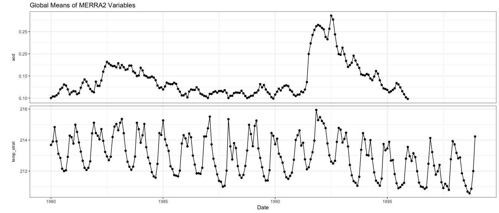

Preparing MERRA-2 Data to be Used for Examples in `listenr`
================
<br> Updated on April 04, 2024

This notebook contains information and code used to generate the data
`merra2` contained in `listenr`.

Load R packages:

``` r
library(dplyr)
library(ggplot2)
library(lubridate)
library(tidyr)
```

Load data:

- These datasets were manually downloaded from the Goddard Earth
  Sciences Data and Information Services Center:
  <https://disc.gsfc.nasa.gov/>. The files contain data from Modern-Era
  Retrospective Analysis for Research and Applications, Version 2
  (MERRA-2). Specifically:

  - `aod_raw`: contains vertically integrated monthly AOD values
    (obtained from
    <https://disc.gsfc.nasa.gov/datasets/M2TMNXAER_5.12.4/summary>)
  - `temp_strat_raw`: contains monthly stratospheric temperatures at 50
    mb (obtained from
    <https://disc.gsfc.nasa.gov/datasets/M2IMNPASM_5.12.4/summary>)

- For more information on MERRA-2 see the following references:

  - Gelaro, R., W. McCarty, M. J. Suarez, R. Todling,A. Molod, L.
    Takacs, C. A. Randles, A. Darmenov,M. Bosilovich, R. Reichle, K.
    Wargan, L. Coy, R. Cul-lather, C. Draper, S. Akella, V. Buchard, A.
    Conaty, A. M.da Silva, W. Gu, G.-K. Kim, R. Koster, R. Lucchesi,D.
    Merkova, J. E. Nielsen, G. Partyka, S. Pawson, W. Put-man, M.
    Rienecker, S. D. Schubert, M. Sienkiewicz,and B. Zhao, 2017: The
    modern-era retrospective anal-ysis for research and applications,
    version 2 (merra-2).Journal of Climate,30, 5419–5454,
    <doi:10.1175/JCLI-D-16-0758.1>.
  - Randles, C. A., A. M. da Silva, P. Colarco, A. Darmenov,R.
    Govindaraju, A. Smirnov, B. Holben, R. Ferrare,J. Hair, Y.
    Shinozuka, and C. Flynn, 2017: The merra-2aerosol reanalysis, 1980
    onward. part i: System descrip-tion and data assimilation
    evaluation.Journal of Climate,30, 6823–6850,
    <doi:10.1175/JCLI-D-16-0609.1>.

``` r
aod_raw = read.csv("merra2/tavgM_2d_aer_Nx/TOTEXTTAUall_48x24.csv")
temp_strat_raw = read.csv("merra2/instM_3d_asm_Np/MERRA2_3dasm_temperature_50mb_48x24.csv")
```

Clean up datasets in order to join:

- Remove the `lev` variable from the stratospheric data
- Rename variables with better labels
- Convert date to `lubridate` variable – importance since character
  strings are different between datasets (e.g., 1980-1-1 vs 1980-01-01)
- Correct stratosphere day (I noticed that stratosphere day was 0 and
  should be 1)

``` r
aod <- 
  aod_raw %>% 
  rename("aod" = "TOTEXTTAU") %>%
  mutate(date = as_date(date))

temp_strat <-
  temp_strat_raw %>% 
  select(-lev) %>% 
  rename("temp_strat" = `T`) %>%
  mutate(date = as_date(date)) %>%
  mutate(day = day(date))
```

Join the cleaned data and reorder columns:

``` r
merra2_full <- 
  full_join(aod, temp_strat, by = c("lon", "lat", "date", "year", "month", "day")) %>%
  select(lon, lat, date, year, month, day, everything()) 
```

Preview part of the cleaned data

``` r
head(merra2_full)
```

    ##         lon  lat       date year month day        aod temp_strat
    ## 1 -176.5625 86.5 1980-01-01 1980     1   1 0.09315277   196.0105
    ## 2 -169.0625 86.5 1980-01-01 1980     1   1 0.09361582   195.9952
    ## 3 -161.5625 86.5 1980-01-01 1980     1   1 0.09367627   195.9541
    ## 4 -154.0625 86.5 1980-01-01 1980     1   1 0.09375635   195.8916
    ## 5 -146.5625 86.5 1980-01-01 1980     1   1 0.09393802   195.8095
    ## 6 -139.0625 86.5 1980-01-01 1980     1   1 0.09413942   195.7095

Plot of variables:

    ## Warning: Removed 36 rows containing missing values or values outside the scale range
    ## (`geom_point()`).

<!-- -->

Assign training/testing data labels, extract necessary variables for ESN
model, filter years, and make sure data are arranged appropriately:

``` r
merra2_train_test <-
  merra2_full %>%
  filter(year >= 1986 & year <= 1995) %>%
  mutate(data = ifelse(year > 1993, "test", "train")) %>%
  select(data, date, lon, lat, aod, temp_strat) %>%
  arrange(lon, lat, date)
```

Compute spatial means on training data:

``` r
merra2_spatial_means_and_sds <- 
  merra2_train_test %>%
  filter(data == "train") %>%
  group_by(lon, lat) %>%
  summarise(
    aod_mean = mean(aod, na.rm = TRUE),
    temp_strat_mean = mean(temp_strat, na.rm = TRUE),
    aod_sd = mean(aod, na.rm = TRUE),
    temp_strat_sd = mean(temp_strat, na.rm = TRUE),
    .groups = "drop"
  )
```

Add means and center variables to prepare values to be used in the ESN:

``` r
merra2 <-
  left_join(merra2_train_test, merra2_spatial_means_and_sds, by = c("lon", "lat")) %>%
  mutate(
    aod_stdzd = (aod - aod_mean) / aod_sd,
    temp_strat_stdzd = (temp_strat - temp_strat_mean) / temp_strat_sd
  ) %>%
  select(
    data,
    date,
    lon,
    lat,
    aod,
    aod_mean,
    aod_sd,
    aod_stdzd,
    temp_strat,
    temp_strat_mean,
    temp_strat_sd,
    temp_strat_stdzd
  )
```

Save cleaned data to the data folder:

``` r
usethis::use_data(merra2, overwrite = TRUE)
```
