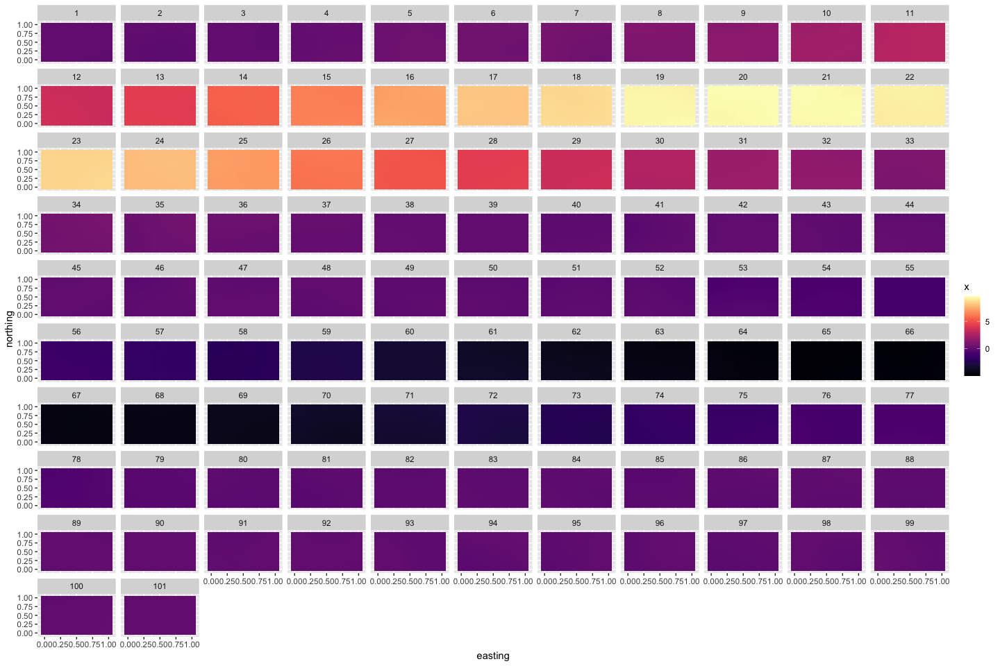
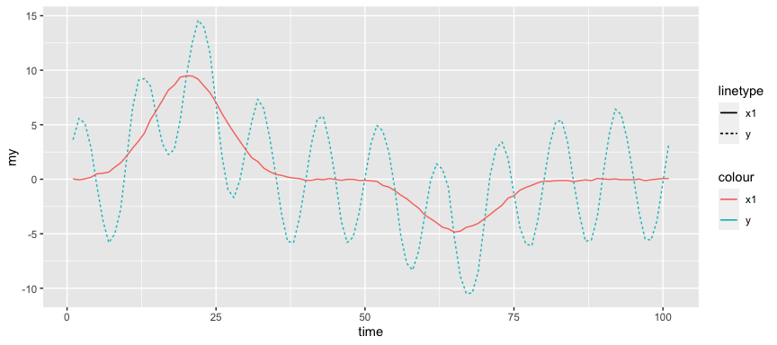
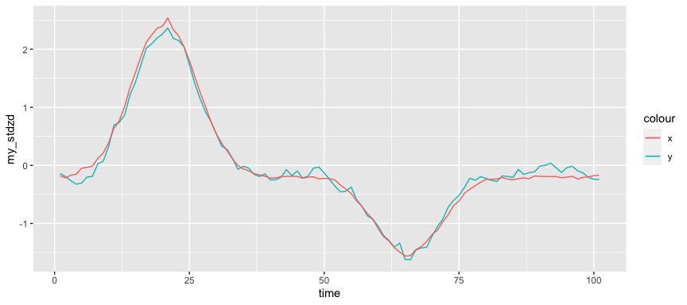

Generation of Simulated Data
================
<br> Updated on March 21, 2024

Load R packages:

``` r
library(dplyr)
library(ggplot2)
library(listenr)
library(purrr)
library(tidyr)
library(viridis)
```

## Set Up

Set up of data generated by Danny:

- $n$: number of spatial locations $s=(x,y)$ on a lattice grid. $n=100$
- $T$: total number of time points. $T=100$
- $Y_{it}(s)$: response $i=1,...,n$ at time $t=1,...,T$
- $x_{1t}(s)$: covariate 1 at time $t=1,...,T$ and location $s$
- $x_{2t}(s)$: covariate 2 at time $t=1,...,T$ and location $s$
- $x_{3t}(s)$: covariate 3 at time $t=1,...,T$ and location $s$
- $x_{4t}(s)$: covariate 4 at time $t=1,...,T$ and location $s$
- $\delta_{it}(s)$ spatio-temporal random effect for response $i$ at
  time $t$ and location $s$. Assume iid Normal errors with constant
  variance
- $\epsilon_{it}(s)$ random error for response $i$ at time $t$ and
  location $s$. Assume iid Normal errors with constant variance

Simulate data from
$Y_{it}(s) = x_{1t}(s)\beta_1 + x_{2t}(s)\beta_2 + x_{3t}(s)\beta_3 + x_{4t}(s)\beta_4 + \delta_{it}(s) + \epsilon_{it}(s)$
setting different

- mean of $x_{1t}(s)$ = `100*dnorm(seq(from=1,to=T+1,by=1),20,6)`
- mean of $x_{2t}(s)$ = `100*dnorm(seq(from=1,to=T+1,by=1),45,6)`
- mean of $x_{3t}(s)$ = `100*dnorm(seq(from=1,to=T+1,by=1),70,6)`
- mean of $x_{4t}(s)$ = `c(rep(0,T-15),rep(5,10),rep(0,5))`

A small amount of highly correlated spatial noise is added to the means
of $x_{1t},x2_{2t},x3_{3t}$ to give the final covariates. This makes the
covariates a spatio-temporal process themselves, which makes them
similar to the scenario in CLDERA.

- covariance of $x_{pt}(s)$ =
  $\sigma^2 e^{-\frac{||s_i-s_j||^2}{2\phi^2}}$

Values of $\beta$ used are:

- $\beta_1$ = 0
- $\beta_2$ = 1
- $\beta_3$ = 0
- $\beta_4$ = 1

Which means only $x_2$ and $x_4$ actually affect $Y$ directly. However,
both $x_1$ and $x_3$ have spikes in value, and we are interested in
seeing whether PFI only picks up covariates when they are important to
predicting $Y$, and not just when the covariates have values large in
magnitude.

This sets the same sizes and parameters for simulating the datasets:

``` r
set.seed(20230323)
nT <- 100
n_pfi <- 200
x.seq <- seq(from = 0, to = 1, length.out = 10)
y.seq <- seq(from = 0, to = 1, length.out = 10)
unit.grid <- expand.grid(easting = x.seq, northing = y.seq)
N.sp <- nrow(unit.grid)
nR <- N.sp
dist.mat <- as.matrix(dist(unit.grid))
x1mean <- 45
xsd <- 10
sigma_x <- 1e-1#1e-5
l_x <- .7#.5
rho_x <- 0.3
sigma_x4 <- .1#0.5
l_x4 <- .7#.5
sigma <- 1
mu1 <- 
  100*dnorm(seq(from=1,to=nT+1,by=1),20,6) -
  50*dnorm(seq(from=1,to=nT+1,by=1),65,6)
```

## Simulate $x_t(s)$ and $Y$

Generates the spatio-temporal surfaces for all the covariates

``` r
set.seed(20230323)
Xt1 <- matrix(NA, nrow = N.sp, ncol = nT + 1)
Xt1[, 1] <-
  MASS::mvrnorm(
    n = 1,
    mu = rep(mu1[1], N.sp),
    Sigma = sigma_x ^ 2 * exp(-(dist.mat ^ 2) / (2 * l_x ^ 2))
  )

for (i in 2:(nT + 1)) {
  Xt1[, i] <-
    rho_x * Xt1[, i - 1] + 
    MASS::mvrnorm(
      n = 1, 
      mu = rep(mu1[i], N.sp),
      Sigma = sigma_x ^ 2 * exp(-(dist.mat ^ 2) / (2 * l_x ^ 2))
    )
  #if(i%%10==0){print(i)}
}

Xt_df <- data.frame(
  easting = rep(unit.grid$easting, nT + 1),
  northing = rep(unit.grid$northing, nT + 1),
  x1 = c(Xt1),
  time = rep(1:(nT + 1), each = (length(x.seq) * length(y.seq)))
)
```

``` r
set.seed(20230223)
rho <- 0.7
mu <- 0
sigma_eta <- 0.5 #sill
sigma_d <- 0.1 #nugget
l <- .3 #range

etaMat <- matrix(NA,nrow=N.sp,ncol=nT+1)
etaMat[,1] <- 
  MASS::mvrnorm(
    n = 1, 
    mu = rep(0, N.sp),
    Sigma = sigma_eta^2*exp(-(dist.mat^2)/(2*l^2))
  )

for(i in 2:(nT+1)){
  etaMat[,i] <- 
    rho*etaMat[,i-1] + 
    MASS::mvrnorm(
      n = 1, 
      mu = rep(0, N.sp),
      Sigma = sigma_eta^2*exp(-(dist.mat^2)/(2*l^2))
    )
  #if(i%%10==0){print(i)}
}

etaMat_df <- 
  data.frame(
    easting = rep(unit.grid$easting,nT+1),
    northing = rep(unit.grid$northing,nT+1),
    ta.error = c(etaMat),
    time = rep(1:(nT+1),each=(length(x.seq)*length(y.seq)))
  )
```

This simulates the response $Y$ according the definition at the begining

``` r
set.seed(20230223)
beta0 <- rep(0,nT+1)
beta1 <- rep(1,nT+1)
beta1[45:95] <- 1

season_amp <- 6
season_period <- pi/5
gamma <- 0.01

Yt4 <-  
  t(sapply(1:(nT+1),function(x) Xt1[,x]*beta1[x])) +
  matrix(rnorm(n = (nT+1)*N.sp, sd = sigma), ncol = N.sp) +
  season_amp * sin(1:(nT+1)*season_period) + t(etaMat)

dat <- cbind(unit.grid, t(Yt4))
names(dat)[-c(1:2)] <- as.character(1:(nT+1))
dat <- 
  dat %>%
  pivot_longer(
    cols = !c(easting, northing),
    names_to = "time", 
    values_to = "val"
  )
dat$time <- as.numeric(dat$time)
dat <- left_join(dat, Xt_df, by = c("easting", "northing", "time"))
```

## Preprocessing

Clean up variable names:

``` r
ta6 = dat %>% rename(y = val, x = x1)
```

Create location ID associated with longitude and latitude:

``` r
ta6_locs <-
  ta6 %>%
  select(easting, northing, time, y) %>%
  pivot_wider(
    id_cols = c(easting, northing),
    names_from = time,
    values_from = y
  ) %>%
  mutate(loc_id = 1:n()) %>%
  select(loc_id, easting, northing)
```

Compute training data spatial means and SDs:

``` r
ta6$time_group <- ta6$time %% 10
ta6_spatial_means <-
  ta6 %>%
  group_by(time_group, easting, northing) %>%
  summarise_at(
    .vars = vars(y, x),
    .funs = mean,
    .groups = "drop"
  ) %>%
  rename_at(
    .vars = vars(y, x),
    .funs = function(var) paste0(var, "_mean"),
  )
ta6_spatial_sds <-
  ta6 %>%
  group_by(time_group, easting, northing) %>%
  summarise_at(
    .vars = vars(y, x),
    .funs = stats::sd
  ) %>%
  ungroup() %>%
  rename_at(
    .vars = vars(y, x),
    .funs = function(var) paste0(var, "_sd"),
  )
```

Center and scale variables based on training data:

``` r
ta6_esn <-
  left_join(ta6, ta6_spatial_means, by = c("easting", "northing", "time_group")) %>%
  left_join(ta6_spatial_sds, by = c("easting", "northing", "time_group")) %>%
  mutate(
    y_stdzd = (y - y_mean) / y_sd,
    x_stdzd = (x - x_mean) / x_sd
  ) %>%
  select(easting, northing, time, x, y, x_mean, y_mean, x_sd, y_sd, x_stdzd, y_stdzd)
```

## Visualizations

Heatmaps of $x_{1t}(s)$:

<!-- -->

Heatmaps of $Y_{t}(s)$:

<!-- -->

Heatmaps of climiatologies of $Y_{t}(s)$:

<!-- -->

Relationship between $Y$ and $x$ (average values over all spatial
locations):

<!-- -->

Relationship between climatologies of $Y$ and $x$ (average values over
all spatial locations):

<!-- -->

## Save Data

Rename simulated data:

``` r
sim = ta6_esn
```

Save cleaned data to the data folder:

``` r
usethis::use_data(sim, overwrite = TRUE)
```
